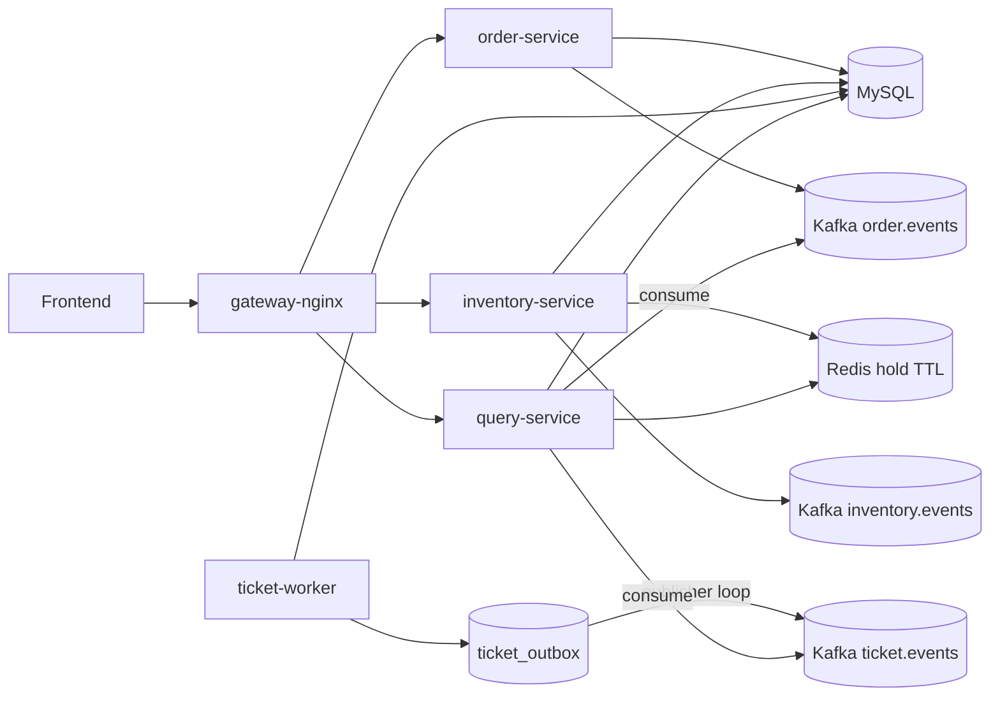

# Ticketing Architecture Overview

## Runtime Topology

## Consistency Rules

- Inventory mutations are serialized by partitioned actor model.
- Memory state must not advance without durable WAL/outbox acceptance.
- Query consumer commits offset only after DB transaction succeeds.
- Ticket events are produced from `ticket_outbox` to guarantee eventual delivery.

